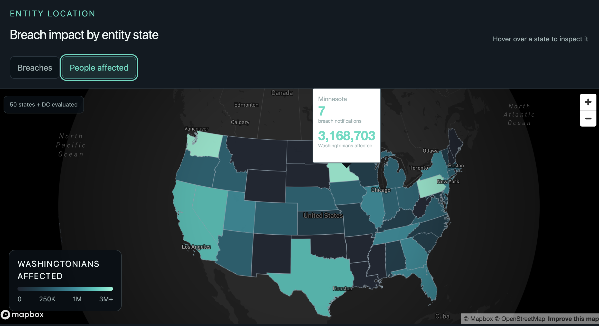
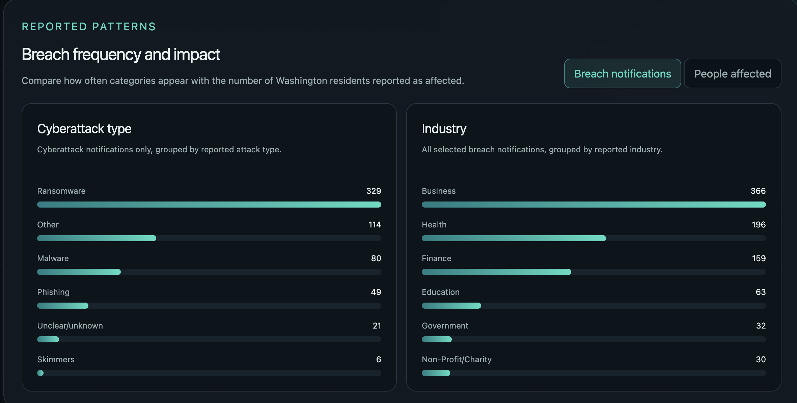

# Washington Data Breach Analysis

An exploratory analysis and interactive GIS visualization of data breach notifications affecting Washington residents. The project combines a reproducible Python data pipeline with a React and Mapbox website to compare breach frequency with the number of Washington residents reported as affected.

## Excecutive Summary

The interactive web map shows the reported location of breached organizations and lets viewers switch between breach-notification counts and affected-resident totals.



The supporting charts compare cyberattack types and industries using the same two measurements.



## Project motivation

My interest in information technology, cybersecurity, and spatial data analysis has grown steadily over time. This project gave me an opportunity to explore those interests, develop new technical skills, and examine an issue that directly affects people in my community.

I am especially interested in data breaches because they demonstrate how important data security has become in modern life. As technology becomes more integrated into our daily lives, systems containing personal and financial information become increasingly valuable targets. Without strong security practices, vulnerabilities can be exploited, potentially causing serious harm to the people whose information is exposed.

## Research questions

1. Which cyberattack types were reported most frequently during AGO reporting years 2022 through 2025?
2. Where were the breached organizations that affected Washington residents located?
3. Which industries were associated with the most breach notifications?
4. How do the results change when comparing breach-notification counts with the reported number of Washington residents affected?

## Data source and scope

The project uses the Washington State Attorney General's Office (AGO) [Data Breach Notifications Directory](https://www.atg.wa.gov/data-breach-notifications). The local data snapshot, `Data_Breach_Notifications_Affecting_Washington_Residents_20260813.csv`, was retrieved on August 13, 2026.

The analysis focuses on AGO reporting years 2022 through 2025, four complete and recent reporting cycles with substantially more complete entity-state information than earlier years. An AGO reporting year runs from July 24 through July 23 of the following calendar year and should not be interpreted as a standard calendar year. The selected period contains 846 unique breach notifications.

## Key findings

The map and charts reveal important differences between breach frequency and overall impact. Washington had the most reported breach notifications, with 236 incidents affecting approximately 11.9 million Washington residents. California and Texas also had relatively high notification counts, with 82 and 37 incidents, respectively. These locations represent the reported states of the breached organizations—not the origins of the cyberattacks.

A state with relatively few notifications can still account for a large number of affected residents. Minnesota, for example, had only seven breach notifications, but those incidents affected approximately 3.2 million Washington residents. This demonstrates how one or more unusually large breaches can significantly influence affected-resident totals.

Among incidents categorized as cyberattacks, ransomware was the most frequently reported type. It accounted for 329 notifications and approximately 9.9 million affected Washington residents. This finding highlights ransomware as an important area of concern for organizations and cybersecurity professionals.

Business and health were the two industries associated with the most breach notifications. Business accounted for 366 notifications and approximately 12.9 million affected residents, while health accounted for 196 notifications and approximately 10.8 million affected residents. Together, these results emphasize the importance of strong security practices in organizations that manage substantial amounts of personal and sensitive information.

## Methodology and architecture

```text
AGO CSV
  -> Python and Pandas cleaning and validation
  -> 2022–2025 state, cyberattack, and industry aggregations
  -> generated JSON summary
  -> React and TypeScript interface
  -> Mapbox choropleth and interactive CSS charts
```

The Python pipeline validates required columns, filters the selected reporting years, checks notification IDs, standardizes entity-state values, converts affected-resident counts to numeric values, and aggregates results by state, cyberattack type, and industry. The exporter writes these results to `web/app/breach-summary.json`, allowing the website to load a compact summary instead of processing the full CSV in the browser.

The choropleth maps the reported location of each breached organization—not the attacker, the affected residents, or necessarily the technical location of the incident. It calculates both distinct breach-notification counts and the sum of `WashingtoniansAffected` for each valid entity state. The charts apply the same measurements to cyberattack types and industries, making it possible to compare how often a category appears with its reported impact.

The presentation layer uses React, TypeScript, Mapbox GL JS, Vinext, and Vite. The category charts are built with semantic HTML and CSS, without an additional charting library.

## Run the web map locally

### Requirements

- Python 3 with `venv`
- Node.js 22.13 or newer
- [A public Mapbox access token](https://docs.mapbox.com/help/getting-started/access-tokens/)

### 1. Clone the repository

```bash
git clone https://github.com/cobywg/washington-data-breach-analysis.git
cd washington-data-breach-analysis
```

### 2. Prepare the data

On macOS or Linux:

```bash
python3 -m venv .venv
source .venv/bin/activate
python -m pip install -r requirements.txt
python src/export_web_data.py
```

On Windows PowerShell:

```powershell
python -m venv .venv
.venv\Scripts\Activate.ps1
python -m pip install -r requirements.txt
python src/export_web_data.py
```

The exporter regenerates `web/app/breach-summary.json`. Run it again whenever the source CSV or transformation logic changes; do not edit the generated JSON manually.

### 3. Configure Mapbox

Copy the example environment file:

```bash
cp web/.env.example web/.env.local
```

Windows PowerShell users can run:

```powershell
Copy-Item web/.env.example web/.env.local
```

Open `web/.env.local` and replace the placeholder with a restricted public Mapbox token:

```env
NEXT_PUBLIC_MAPBOX_TOKEN=your_public_mapbox_token
```

### 4. Install dependencies and start the site

```bash
cd web
corepack pnpm install
corepack pnpm dev
```

Open [http://localhost:3000](http://localhost:3000) in a browser. Stop the development server with `Ctrl+C`.

To verify a production build:

```bash
corepack pnpm lint
corepack pnpm build
```

## Limitations

This analysis includes only breach notifications submitted to the Washington State Attorney General's Office under applicable reporting requirements, so it does not represent every cybersecurity incident affecting Washington residents. The reported entity state identifies the location of the breached organization—not the attacker's origin, the affected residents' locations, or necessarily where the intrusion occurred. Geographic information is also incomplete: 60 of the 846 selected notifications lacked a valid entity-state value and were retained in the overall totals but could not be displayed on the map. Two notifications lacked usable affected-resident counts, and the total number affected should not be interpreted as a count of unique individuals because the same person may appear in multiple breaches. In addition, a small number of unusually large incidents can strongly influence totals, while broad categories such as “Other” and “Unclear/unknown” limit more detailed interpretation. Finally, the results are raw notification and affected-resident counts rather than normalized measures of risk, as they are not adjusted for factors such as population, industry size, number of organizations, customer base, or reporting exposure.

## Conclusion

This analysis demonstrates how personal information held by organizations across the United States can be exposed through data breaches affecting Washington residents. By aggregating and visualizing the data, the project answered the research questions and revealed clear patterns in cyberattack type, organization location, and industry. Ransomware was the most frequently reported cyberattack type, accounting for 329 breach notifications across the four AGO reporting years from 2022 through 2025.

Breached organizations were reported in 46 states, although the largest affected-resident totals were associated with organizations in Washington, Pennsylvania, Minnesota, Nevada, California, and Texas. Business and health were the industries associated with the most notifications. The comparison between frequency and impact was especially important: the dataset contained 846 breach notifications but approximately 30 million reported instances of Washington residents being affected. This contrast shows that the number of incidents alone does not fully describe their consequences, because even a small number of large breaches can affect millions of people. Ultimately, the project reinforces the importance of building secure systems and protecting personal information as matters of individual, organizational, and national security.

